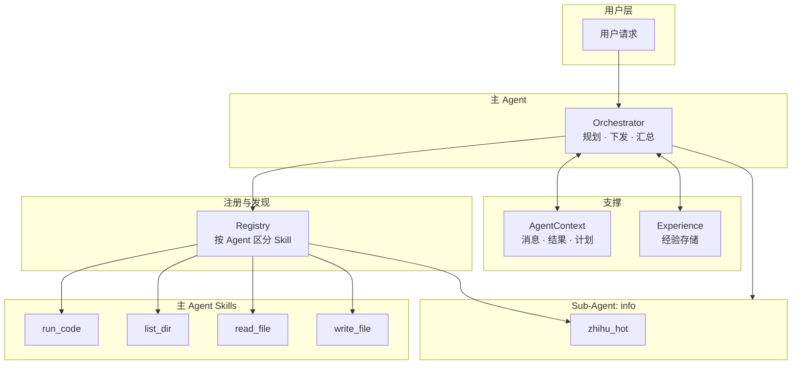
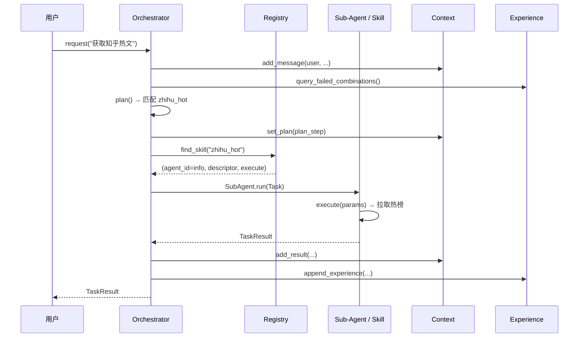
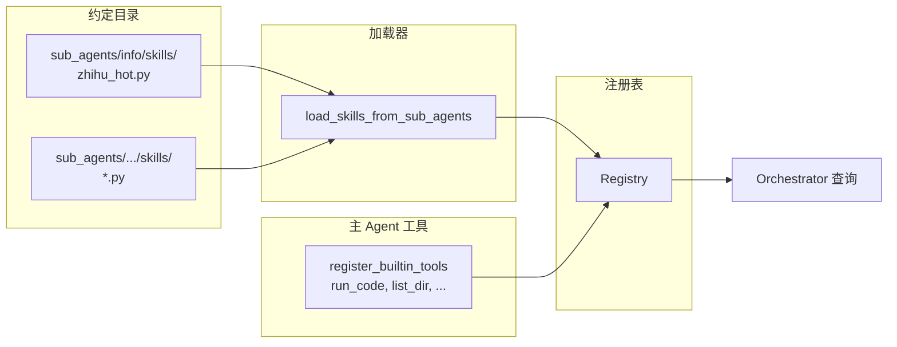

# Agent 技术架构图

## 1. 组件总览



## 2. 请求处理流程



## 3. Skill 加载与注册



## 4. 契约与数据流

```mermaid
flowchart LR
    subgraph 任务契约
        T[Task<br/>task_id, skill, params, context]
    end

    subgraph 结果契约
        R[TaskResult<br/>task_id, status, result|error]
    end

    subgraph Skill 描述
        D[SkillDescriptor<br/>name, description, sub_agent, input_schema]
    end

    T --> Execute[execute(params)]
    Execute --> R
    D --> Reg[Registry]
```

---

说明：

- **Orchestrator**：根据请求做规划（规则匹配或后续扩展 LLM），通过 Registry 解析目标 Agent + Skill，再下发 Task 或本地执行。
- **Registry**：维护「Agent → Skill 列表」；主 Agent 的 Skill（含内置工具）与各 Sub-Agent 的 Skill 分开存储，按 name/description 查询。
- **Sub-Agent**：按 `task.skill` 从 Registry 取执行函数并调用，返回统一 TaskResult。
- **Context**：可选；存历史消息与结果，超阈值时自动 compact。
- **Experience**：可选；记录成功/失败，规划时可参考以自我演进。
