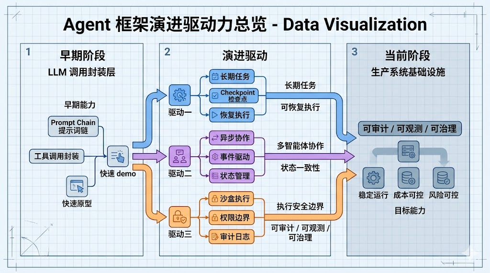
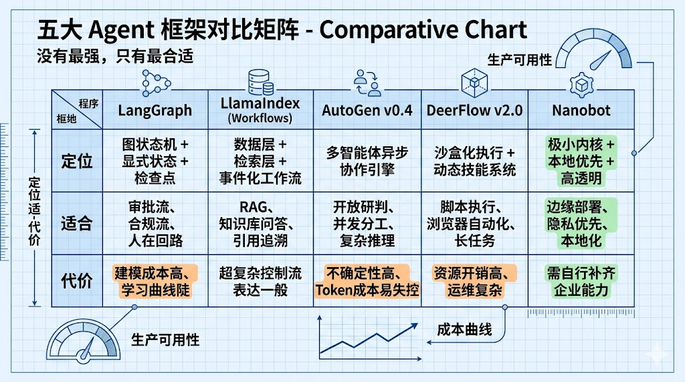
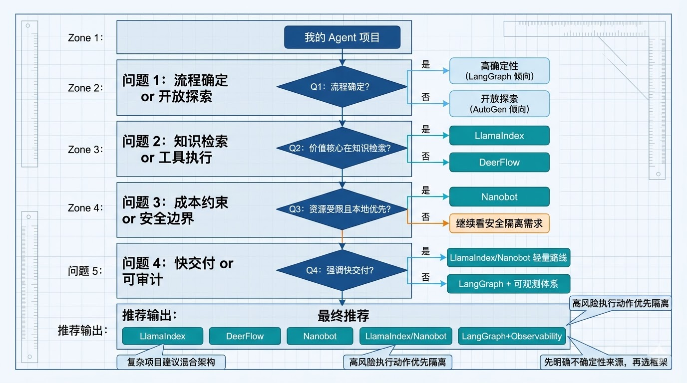
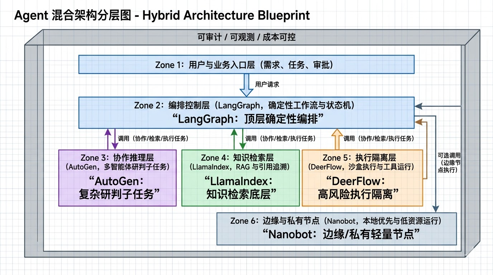

# 2026 年 Agent 框架对比：没有“最强”，只有“最合适”

过去两年，大家讨论 Agent 框架最常见的问题是：

- 到底选 `LangGraph` 还是 `LlamaIndex`？
- `AutoGen` 还能不能上生产？
- `DeerFlow` 这种“超级智能体底座”是不是未来？
- `Nanobot` 这种极简路线是玩具，还是新范式？

如果你也在做企业级 Agent 落地，这篇文章给你一个可执行结论：

> **2026 年，不存在唯一最优框架。真正的竞争维度已经从“API 好不好用”，变成“控制流、执行环境、安全边界、可观测性、成本曲线”。**

---

## 一、先看趋势：Agent 框架正在“分化”

早期的框架更像“LLM 调用封装层”，强调快速搭 Demo。现在不一样了：

- 业务开始要求长期任务、可恢复执行、可审计；
- 多智能体协作进入生产，异步与状态一致性变成硬需求；
- 安全边界上升到系统级（尤其是会执行代码的 Agent）。

换句话说，框架正在从“开发体验工具”升级为“生产系统基础设施”。

---

## 二、五大主流框架，一句话定位

### 1) LangGraph：**确定性工作流之王**

核心是“图状态机 + 显式状态 + 检查点”。

适合：
- 有严格业务边界和审批流程的自动化场景；
- 需要人在回路（Human-in-the-loop）；
- 需要“时间旅行调试”回滚执行路径。

代价：
- 建模与状态定义成本高；
- 学习曲线陡，简单任务容易“过度工程化”。

---

### 2) LlamaIndex（Workflows）：**数据检索优先的生产选择**

核心是“数据层 + 检索层 + 事件化工作流”。

适合：
- RAG/企业知识库/文档问答为主的场景；
- 对幻觉抑制、引用追溯要求高；
- 希望比纯图编排更易维护的团队。

代价：
- 对“极复杂非线性控制流”的表达不如 LangGraph 直观；
- 若任务几乎不依赖数据检索，优势不明显。

---

### 3) AutoGen（v0.4）：**多智能体协作引擎**

v0.4 的关键升级是“异步、事件驱动、可观测”。

适合：
- 多角色协作、并发分工、群聊式研判；
- 研究分析、复杂推理、开放式问题求解。

代价：
- 对话式协作天然带来不确定性；
- 若缺乏护栏，容易出现循环对话与 Token 成本失控。

---

### 4) DeerFlow（v2.0）：**可执行“数字员工”底座**

核心不是“框架 API”，而是“沙盒化执行环境 + 动态技能系统”。

适合：
- 需要 Agent 真实执行脚本、浏览器自动化、长周期任务；
- 追求全栈自主执行能力的研发组织。

代价：
- 容器化底座资源开销高；
- 架构更“自用化”，团队需要接受其运行范式。

---

### 5) Nanobot：**极简透明派代表**

核心是“极小内核 + 本地优先 + 高透明度”。

适合：
- 边缘设备、低资源环境、本地化部署；
- 对隐私与数据主权要求极高；
- 想掌握底层控制、避免重中间件的团队。

代价：
- 需要工程团队具备更强的系统能力；
- 某些企业级“开箱即用能力”需自行补齐。

---

## 三、怎么选：看四个问题，不看“热度榜”

### 问题 1：你的任务是“流程确定”还是“开放探索”？

- **流程确定**（审批、合规、固定环节）→ 优先 `LangGraph`
- **开放探索**（多角度研判、讨论求解）→ 优先 `AutoGen`

### 问题 2：你的价值核心在“工具执行”还是“知识检索”？

- **知识检索是核心** → `LlamaIndex`
- **工具执行是核心**（跑脚本、调浏览器、产物落地）→ `DeerFlow`

### 问题 3：你的约束是“算力成本”还是“安全边界”？

- **资源受限/本地优先** → `Nanobot`
- **执行安全隔离优先** → `DeerFlow`（沙盒化）

### 问题 4：你的团队更在意“快交付”还是“可控可审计”？

- **快交付、快速试错** → 先轻量路线（LlamaIndex / Nanobot）
- **可控可审计、稳定运营** → LangGraph + 可观测体系

---

## 四、最实用的落地方案：混合架构，而非单框架信仰

很多团队最终会走到同一个答案：

- `LlamaIndex` 做知识检索底层；
- `LangGraph` 做顶层确定性编排；
- `AutoGen` 处理少量高复杂研判子任务；
- `DeerFlow` 承接高风险执行动作并隔离；
- `Nanobot` 用于边缘或私有化轻量节点。

这不是“堆技术栈”，而是把不同框架放到它最擅长的位置。

---

## 五、结论

如果你只记住一句话，请记这个：

> **Agent 框架的本质，不是模型调用接口，而是“如何管理不确定性”。**

- LangGraph 管的是“流程不确定性”；
- LlamaIndex 管的是“知识不确定性”；
- AutoGen 管的是“协作不确定性”；
- DeerFlow 管的是“执行不确定性”；
- Nanobot 管的是“资源与主权不确定性”。

你要做的，不是押注“谁会赢”，而是明确：

1. 你的业务不确定性来自哪里；
2. 你的组织能承受哪类成本；
3. 你要把风险隔离在系统的哪一层。

当这三件事想清楚，框架选择会变得非常直接。

---

## 参考资料（节选）

1. LangGraph 官方文档与实践案例  
2. LlamaIndex Workflows 与 RAG 架构对比资料  
3. Microsoft AutoGen v0.4 架构说明  
4. DeerFlow 开源仓库与技术解读  
5. HKUDS Nanobot 项目文档  

（本文基于《LLM框架对比与选型建议》提炼改写）
