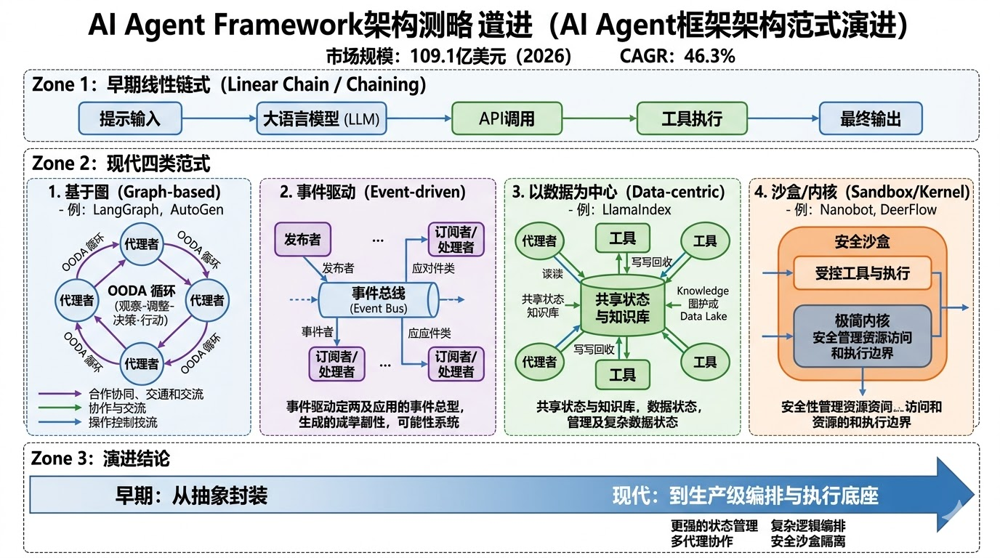
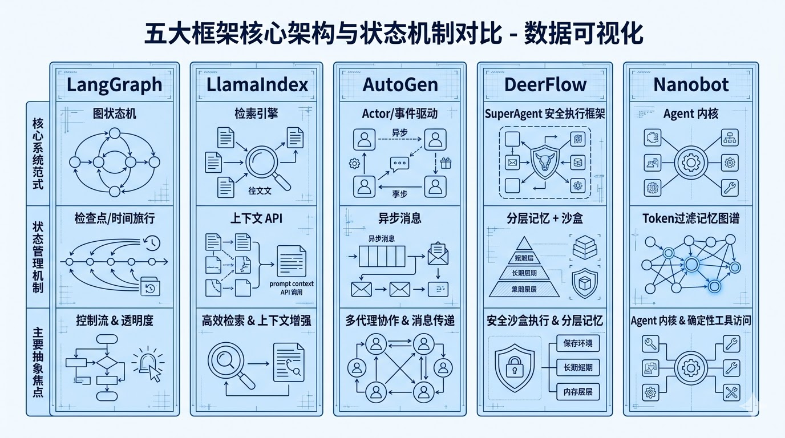
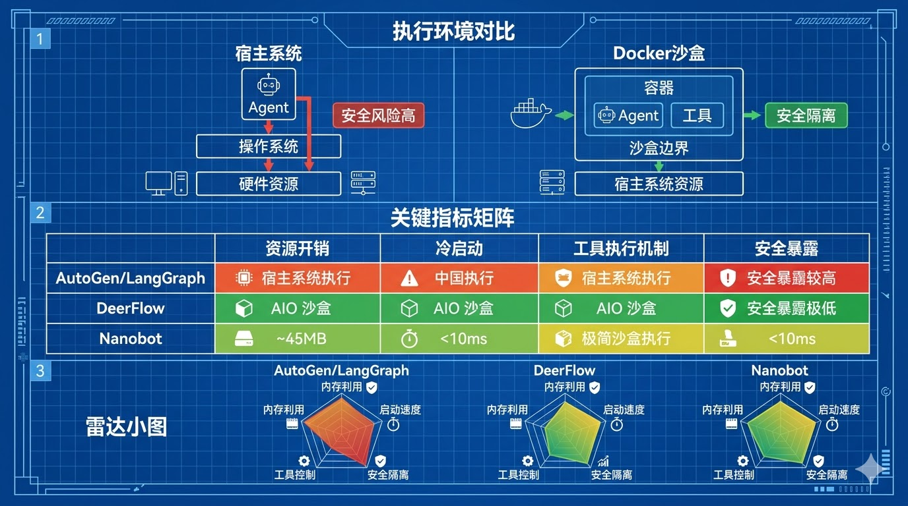
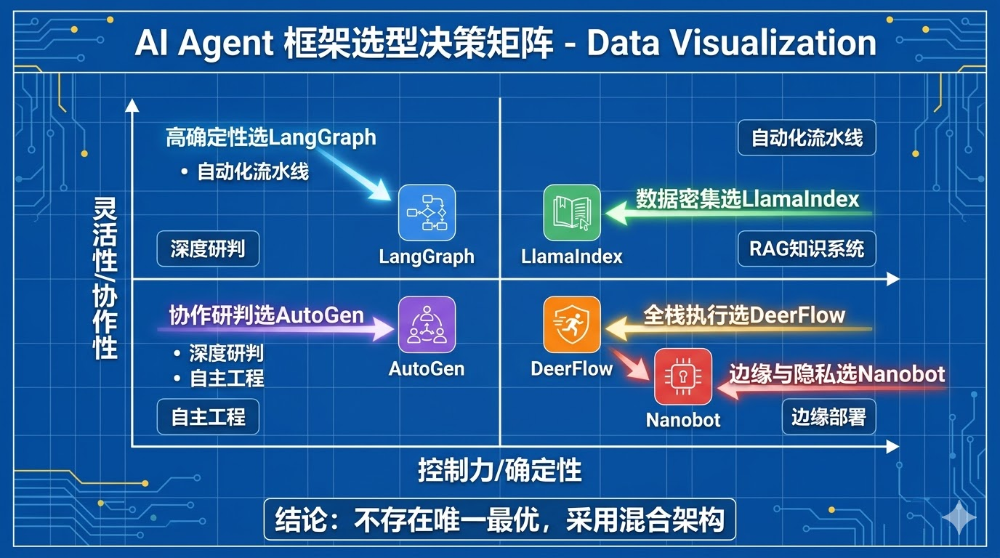

# **2026年新一代AI Agent框架深度对比分析：架构范式、执行环境与生产级动态**

随着人工智能技术从单一的静态大语言模型（LLM）推理向具备长期规划、工具执行和复杂推理能力的自主多智能体系统演进，底层支撑框架的架构哲学已经发生了根本性的分化。市场数据显示，到2026年，AI Agent市场规模预计将达到109.1亿美元，并以46.3%的复合年增长率持续扩张至2030年1。在这一背景下，早期仅仅作为API调用封装层的框架已经无法满足企业级生产的需求，促使了专业化编排引擎的全面崛起2。现代AI Agent框架不仅需要处理自然语言，更需要管理完整的“观察-定位-决策-行动”（OODA）循环，同时在分布式环境中保持状态的绝对一致性2。

本研究报告对当前定义AI生态系统的五大核心Agent框架进行了详尽的对比分析：LangChain生态下的LangGraph、专注于数据检索的LlamaIndex（Workflows）、微软主导的重构版AutoGen（v0.4）、字节跳动开源的超级智能体底座DeerFlow（v2.0），以及香港大学数据科学系（HKUDS）推出的极简内核架构Nanobot。这五种框架分别代表了解决智能体状态管理、多智能体协作、安全执行隔离以及开发者体验等核心挑战的不同范式。通过深入剖析它们的内部架构、性能基准测试以及在真实生产环境中的可行性，本报告阐明了现代自主系统是如何超越脆弱的原型阶段，演变为具有高弹性和高可靠性的生产级软件组件的。

## **编排与状态管理的架构演进**

从简单的单轮对话机器人向自主智能体的过渡，要求底层框架具备在极长的时间跨度内管理复杂状态的能力。在早期的LLM应用开发中，框架严重依赖隐式状态管理和线性链式调用（Chaining）。最新的生态系统调查报告表明，由于过度抽象、不透明的中间件导致调试困难，以及频繁引发的代码膨胀，早期的线性框架（如早期的LangChain抽象）在开发者社区的活跃度出现了急剧下降3。企业级应用将57%的研发资源投入到生成式AI的生产部署中，这迫使行业对框架的控制力、可观测性以及定制化执行环境提出了前所未有的严格要求1。

当前的生态系统格局由抽象与控制之间的张力所定义。试图将所有LLM交互泛化的单体框架正面临淘汰，取而代之的是高度优化的垂直领域架构。基于图（Graph）的状态机为执行路径提供了细粒度的控制4；事件驱动架构实现了异步、分布式的多智能体无阻塞通信5；以数据为中心的框架则将高保真检索的优先级置于复杂的路由逻辑之上6。与此同时，新一代的工具将核心注意力转移到了执行底座上，为智能体提供了容器化的操作系统环境7，或者反其道而行之，将架构精简至极简内核，以最大限度地提高系统的透明度和运行时的安全性8。理解这些底层架构的范式转移，是设计和构建现代AI系统的关键前提。

## **LangGraph：生产级状态机与确定性路由**

LangGraph作为LangChain生态系统中的底层编排框架，代表了将智能体编排视为基于图的状态机（Graph-based State Machine）的范式转移4。受到Pregel和Apache Beam等大规模数据处理框架的启发，LangGraph专门为构建和部署长期运行的、有状态的智能体而设计，在这些场景中，控制流必须是显式的且具备极高的可预测性10。

### **图驱动的路由网络与显式状态控制**

与传统的线性执行链不同，LangGraph将智能体工作流结构化为包含节点（函数或智能体）和边（条件路由逻辑）的有向图9。这种架构从根本上改变了状态管理的方式。在LangGraph中，数据控制是完全显式的；状态对象在节点之间被显式地传递和持续更新，允许开发者为智能体在任何特定步骤必须记忆的内容定义精确的数据模式9。

这种确定性的路由机制对于需要循环执行的复杂分支工作流具有巨大的优势，例如迭代式的代码生成或多阶段的编辑审查流程4。如果智能体在执行过程中遇到错误或需要进一步澄清，图结构可以根据条件逻辑将执行路径路由回之前的状态，形成受控的反馈循环9。这种结构上的刚性确保了智能体无法在默认情况下偏离预定义的业务边界，从而有效地降低了不可控的Token消耗以及级联幻觉的风险12。通过显式定义图的节点和边，系统架构师能够清晰地映射出复杂的业务逻辑，使其与真实世界中的审批和操作流程严格对应。

### **持久化执行与时间旅行调试**

长期运行的自主任务（例如跨越数十个数据源的深度研究或分析庞大的代码库）的一个关键要求是持久化执行（Durable Execution），即系统能够在发生故障时保存状态，并在不丢失上下文的情况下恢复运行10。LangGraph通过配置持久化的检查点（Checkpointing）后端来实现这一目标。对于单进程测试，它支持轻量级的SQLite存储；而对于需要处理高并发写入的生产级部署，则支持PostgreSQL等分布式数据库13。每次执行运行都会被分配一个唯一的线程标识符（Thread ID），允许系统对图在任何历史节点的确切状态进行归档和精确回溯13。

这种检查点机制赋予了LangGraph其最具竞争力的特性之一：时间旅行调试（Time-Travel Debugging）和人在回路（Human-in-the-loop）的监督能力10。由于每一次状态转换都被完整记录，开发人员和系统操作员可以在智能体执行关键操作（例如执行数据库变更或向客户发送正式邮件）之前暂停执行图，检查智能体提议的操作，并在允许图继续运行之前批准该操作或手动修改系统状态10。如果智能体选择了错误的推理路径，操作员可以“时间旅行”回溯到之前的节点，注入纠正性的提示指令，然后从该点重新启动执行14。对于那些自主操作伴随着重大财务或合规风险的企业级工作流而言，这种细粒度的控制能力是不可或缺的。

### **开发者体验与架构权衡**

尽管LangGraph提供了强大的控制机制，但它也引入了陡峭的学习曲线和显著的架构开销。该框架要求开发者采用自定义的语法和运算符重载（Operator Overloading）来定义图的结构，这在很大程度上偏离了标准的Pythonic设计模式，增加了代码的复杂性15。此外，由于LangGraph要求必须在前端全面且精确地定义状态模式，在处理极其复杂的多智能体网络时，状态管理可能会迅速变得冗长且难以维护16。

为了解决开源版本在部署和扩展上的痛点，生态系统中涌现了诸如Aegra等开源的LangGraph Platform替代方案17。这类项目旨在提供自托管的基础设施，消除平台锁定，同时保留LangGraph SDK的完全兼容性17。总体而言，LangGraph在映射复杂、预定的业务逻辑方面表现出色，但其状态管理的刚性在一定程度上抑制了构建高度动态、开放式探索型智能体所需的流动性。对于不需要严格控制流的简单任务，过度使用LangGraph反而会带来不必要的工程负担18。

## **LlamaIndex Workflows：以数据为中心的编排引擎**

当LangGraph将核心精力集中在控制流的精确编排时，LlamaIndex则从数据优先的视角切入智能体架构。最初作为检索增强生成（RAG）领域的首选框架，LlamaIndex已经通过其Workflows范式进化为支持复杂智能体能力的综合性平台4。

### **检索优先的智能体范式**

LlamaIndex的架构特别针对企业级场景进行了优化，在这些场景中，智能体的核心商业价值主要源于其摄取、索引和精确检索专有知识库的能力4。该框架拥有高度模块化的架构，能够无缝连接到各种向量数据库，并构建极其复杂的检索层次结构6。在诸如法律合同对比分析、财务审计追踪或企业内部级搜索等场景中，基于扎实的检索并提供准确引用的能力是首要需求，LlamaIndex通过提供能够主动抑制幻觉的默认模式，在这些指标上超越了通用的编排工具12。

从静态的RAG管道向Agentic RAG的过渡，是通过LlamaIndex的高级查询路由机制实现的。系统能够根据元数据提取或用户查询的语义意图，将查询动态路由到不同的专业检索引擎6。虽然这种机制有效地处理了简单的分支逻辑，但在过去，它缺乏管理长期运行、多步骤智能体交互所需的持久化状态控制能力6。

### **上下文驱动的工作流与状态机对比**

为了满足多步骤智能体编排的迫切需求，LlamaIndex引入了由Context API驱动的持久化工作流（Durable Workflows）15。这种新架构允许开发者构建具有人在回路监督和长生命周期执行能力的状态化、多步系统，从而直接与LangGraph形成了竞争态势15。

这两种框架的核心区别在于开发者体验（Developer Experience, DX）的心智模型。LlamaIndex采用了简单、直观的基于事件驱动的Pythonic抽象，避免了LangGraph所必需的严格图定义和运算符重载15。在LlamaIndex中，状态通过专门的Memory类进行管理，该类支持通过配置session\_id实现会话隔离，支持令牌刷新行为，并提供用于结构化或基于向量回忆的内存块机制15。深度的架构对比表明，几乎所有在LangGraph中可以实现的编排模式，都可以通过LlamaIndex的Workflows以更低的复杂度和更高的可维护性来实现，尤其是当智能体的核心功能围绕数据检索展开时15。

然而，对于需要高度复杂、非线性路由且完全脱离文档检索的工作流，LangGraph显式的图可视化和状态追踪仍然提供了更优的透明度19。因此，在2026年的生产架构中，一种被广泛采纳的最佳实践是将两者混合使用：利用LlamaIndex作为坚实的数据和检索层，同时使用LangGraph来编排顶层的执行工作流和多智能体状态转换19。此外，诸如TrueFoundry Cognita等企业级平台进一步集成了这两种框架的优势，提供了一个统一的、具备企业级合规性和端到端可观测性的RAG规模化管理基础设施19。

## **Microsoft AutoGen (v0.4)：异步事件驱动的多智能体协作**

微软的AutoGen框架在普及多智能体对话（Multi-Agent Conversation）概念方面发挥了历史性的作用。在这种模式下，具有不同预设角色的LLM智能体通过相互对话来协作解决复杂问题4。然而，随着企业级采用率的指数级规模化，早期版本（v0.2）在架构上暴露出了严重的局限性，包括同步阻塞导致的死锁、不可预测的Token成本消耗，以及由于缺乏可观测性而导致的分支循环难以调试12。2025年发布的AutoGen v0.4代表了一次底层的架构割裂，微软从零开始完全重写了该框架，以适应分布式、高可扩展性智能体系统的苛刻要求23。

### **异步架构与消息流控制**

AutoGen v0.4最关键的架构进步是从同步函数调用向完全异步、事件驱动的消息传递协议的范式转变5。在先前的范式中，智能体通过阻塞式调用（例如assistant.send）进行通信，当编排大量专业化智能体或等待高延迟的API响应时，这种方式严重阻碍了系统的整体吞吐量和性能5。

v0.4架构通过引入on\_messages和on\_messages\_stream等异步事件处理程序彻底解决了这一瓶颈5。这种非阻塞设计允许智能体并发处理任务，支持高度复杂的编排模式，例如并行执行和动态任务移交25。此外，系统引入了CancellationToken机制，为开发者提供了异步请求管理的绝对控制权。在复杂的应用中，通过调用取消令牌，开发者可以触发异步的取消异常，从而立即中断长时间运行或陷入无限循环的智能体对话5。事件驱动模型还实现了智能体“内心思考”过程和中间步骤的实时流式传输，极大地提升了执行期间的透明度和用户交互体验5。

### **多智能体拓扑模式与团队动态**

AutoGen原生支持多种用于智能体协作的拓扑模式，能够无缝映射到复杂的企业组织和人类工作流中12：

* **顺序模式（Sequential Patterns）：** 数据在线性的专业化智能体管道中流动。例如，一个执行广泛数据收集的研究员智能体将结果传递给作家智能体，作家智能体生成草稿后，再交由事实核查员智能体进行最终审查25。  
* **并发模式（Concurrent Patterns）：** 中央协调者将独立的子任务并行分发给多个智能体，并在所有并发节点完成工作后整合结果，极大地压缩了复杂任务的执行时间25。  
* **群聊模式（Group Chat Patterns）：** 智能体在一个共享的、动态的对话空间中交互。这种模式利用了LLM的上下文推理能力，通过对话谈判来渐进式地完善解决方案，适用于需要头脑风暴和多维度视角的开放式任务25。  
* **移交模式（Handoff Patterns）：** 智能体在遇到超出其专业领域范围的问题时，能够优雅地将控制权和当前累积的上下文移交给具备特定技能的对等智能体25。

虽然AutoGen v0.4为需要渐进式验证的分析管道提供了极大的灵活性，但框架强烈的对话属性也引入了固有的不可预测性。如果没有严格的护栏限制，参与无约束群聊的智能体很容易陷入对话循环，导致严重的延迟和Token成本激增12。为了应对这一挑战，v0.4版本原生集成了OpenTelemetry，提供了符合行业标准的可观测性支持23。系统架构师现在可以追踪消息依赖关系、记录特定工具的调用延迟，并调试跨分布式环境的对话路径，从而识别并阻断无效的智能体通信23。值得注意的是，这次重大的架构重写也导致了社区的分化，部分开发者选择继续维护基于v0.2非破坏性更新的AG2分支，突显了在多智能体框架生态中向后兼容性与架构革新之间的矛盾22。

## **ByteDance DeerFlow (v2.0)：容器化超级智能体底座**

当LangGraph和AutoGen专注于提供构建多智能体系统所需的原始编排模块时，字节跳动推出的DeerFlow采取了完全不同的演进路线。在2026年2月开源并在24小时内登顶GitHub Trending的DeerFlow 2.0，是一次彻底的底层重写29。它放弃了作为通用“框架”的定位，转而作为一个高度自用化（Opinionated）的“超级智能体底座（SuperAgent Harness）”运行29。这种区别是根本性的：DeerFlow不是提供积木让开发者从零组装，而是直接交付一个具有默认执行模型、内置技能、隔离沙盒和多层记忆系统的完整运行环境29。

### **AIO执行沙盒与文件系统隔离**

DeerFlow架构的核心哲学在于：仅仅让智能体生成代码块或建议Bash命令是远远不够的；一个真正自主的智能体必须具备在持久化环境中安全执行这些命令的能力29。为了实现这一目标，DeerFlow将智能体与一个All-in-One (AIO) Docker沙盒深度绑定7。

这个隔离环境实际上充当了专门分配给智能体线程的虚拟计算机32。沙盒在操作系统层面通过seccomp和cgroup进行严格的资源和网络隔离13，并配备了完整且持久化的文件系统。目录结构被严格划分为代理的工作区（/mnt/user-data/workspace）、用户上传区（uploads）和最终产物输出区（outputs）31。更具颠覆性的是，AIO沙盒内部集成了支持Chrome DevTools Protocol (CDP)的无头浏览器、持久化的Shell终端、Jupyter Notebook交互环境，以及功能完备的VSCode Server7。

这种全栈执行架构使得DeerFlow能够承担长达数小时甚至数天的深度自主任务7。例如，在针对泰坦尼克号数据集的探索性数据分析（EDA）案例中，DeerFlow智能体不仅编写了analyze\_titanic.py和visualize\_titanic.py脚本，还能在沙盒中自主运行这些脚本，读取执行过程中引发的字典格式错误日志，自动修复代码，并最终生成七张高质量的数据可视化图表输出到指定目录7。这种“零污染边界”确保了每一次智能体会话都能保持加密和结构上的绝对隔离，彻底消除了沙盒外逃或宿主机文件被恶意篡改的风险13。

### **动态技能加载与上下文工程**

在大规模部署智能体时，一个长期存在的工程瓶颈是：当向系统提示词（System Prompt）中注入大量复杂的工具描述时，大语言模型的上下文窗口会迅速退化，导致推理准确率下降和成本剧增33。DeerFlow通过首创的动态技能加载架构（Dynamic Skill Loading）优雅地绕过了这一物理限制33。

DeerFlow并没有在初始化时将所有可用工具塞入智能体的上下文中，而是在沙盒文件系统上维护了一个庞大的模块化“智能体技能（Agent Skills）”库（涵盖前端设计、物理、多媒体生成等）7。智能体被编程为具有感知自身需求的能力，它能够在运行时动态读取特定的SKILL.md规范文件和相关的模板文件（例如/mnt/skills/public/image-generation/templates/doraemon.md）7。这种按需加载的架构决策将活动上下文窗口保持在极小的范围内，极大地保护了推理保真度，并断崖式地降低了Token消耗33。这种低上下文开销的设计使得DeerFlow在利用较小的量化模型（如Qwen coder或DeepSeek变体）进行本地化、私有化部署时极具吸引力33。

### **子智能体委派与中间件架构**

在运行时架构上，DeerFlow以一个单一的“主智能体（Lead Agent）”作为入口点，该主智能体底层基于LangGraph编排构建32。当面对极其复杂的项目，超出线性推理的范围时，主智能体将转变为协调者角色，通过规划子任务并生成专业的子智能体（Sub-agents）来并行或顺序执行这些任务，最终对它们的报告进行归纳综合32。

系统的后端采用了严格的职责分离层级：Harness层作为可发布的底座包（包含模型、MCP、工具和沙盒），以及处理IM渠道集成（如飞书、Slack、Telegram）的未发布App应用层34。系统内置了包含9个组件的复杂中间件链，用于处理跨领域关注点，能够根据当前子任务的性质，动态选择是否激活视觉支持功能或调用具有深层推理能力（Thinking）的模型32。通过内置这些强主张的架构设计，开发者虽然用绝对的底层灵活性交换了系统约束，但换来的是开发和部署可执行代码的超级智能体的无与伦比的迭代速度29。

## **HKUDS Nanobot：极简主义与内核级代理架构**

在主流框架（如动辄包含数十万行代码的OpenClaw）架构日趋庞大、单体化的同时，学术界和开源社区发起了一场向极简主义回归的运动35。由香港大学数据科学系（HKUDS）研发的Nanobot正是这一运动的先锋代表37。Nanobot将核心Python代码精简至约4,000行，用不到OpenClaw 1%的代码量交付了其99%的核心功能，彻底颠覆了复杂AI系统必须依赖庞大代码库的传统认知36。

### **“智能体内核”哲学与安全至上**

驱动Nanobot的深层架构哲学是“智能体内核（Agent Kernel）”的概念8。类似于Linux操作系统的内核，Nanobot的核心框架只负责管理绝对必要的基础设施：推理循环、基于Token的基础记忆结构、工具执行接口以及统一的通信网关8。所有其他扩展功能均被委托给基于SDK的插件生态系统8。

这种极端的极简主义精准打击了现代AI开发中的一个核心痛点：开发者对过度抽象的中间件丧失了理解和控制能力3。庞大的框架往往将原始的API请求深埋在复杂的类继承树中，导致研究人员在调试智能体异常行为时面临着黑盒困境40。Nanobot的代码库被有意设计为具备极高的可读性，一名具备基础Python经验的开发者在几小时内即可通读并完全理解其全部逻辑35。这种透明度消除了工程摩擦；开发者可以轻松地对核心逻辑进行Monkey-patch、注入自定义的安全遥测技术，或者为了特定的本地化研究实验而直接修改推理循环，而无需与错综复杂的依赖关系树作斗争36。

在安全性方面，Nanobot在2026年采取了激进的重构，彻底移除了对litellm的依赖，转而使用原生的OpenAI和Anthropic SDK38。这一举措是为了应对开源生态中日益严峻的软件供应链投毒威胁，通过减少第三方依赖，Nanobot从根本上缩小了其攻击面，确立了其在安全性要求极高的研究环境中的核心地位38。

### **极致性能、微型足迹与本地化生存能力**

极简架构带来了显著的性能飞跃。与OpenClaw等需要长时间存活的后台守护进程和庞大内存消耗的框架相比，Nanobot的冷启动时间不到10毫秒，且基础内存占用仅为约45MB（不包括LLM推理开销）42。

这种微型足迹使得Nanobot在资源受限的边缘计算环境中展现出非凡的生存能力，例如Raspberry Pi集群或低规格的虚拟专用服务器（VPS）37。通过与vLLM、Ollama以及OpenVINO Model Server (OVMS)的无缝集成，组织可以将LLM推理请求完全路由至本地部署的模型（如Qwen系列），从而构建完全离线运行的、满足最严苛隐私保护要求的自主智能体38。此外，它还提供了可选的多实例隔离Docker部署方案，允许开发者共享同一份底层代码，同时运行生产、测试和实验环境的智能体39。

### **跨渠道统一网关与记忆持久化**

尽管体积轻量，Nanobot在互操作性上并未做出任何妥协。它构建了一个统一的网关架构，负责管理横跨大量企业和消费者通信协议的并发连接38。该框架原生支持Telegram、Discord、Slack、支持端到端加密（E2EE）的Matrix协议，以及通过IMAP/SMTP集成的电子邮件接口38。至关重要的是，针对企业级场景，Nanobot原生支持飞书（Feishu）和钉钉（DingTalk）的WebSocket长连接/流模式38。这意味着智能体可以实时接收多模态文件并在内部网络中运行，完全不需要暴露公共IP地址或配置复杂的Webhook，这是许多企业内网合规部署的强制要求38。对于WhatsApp，它提供了一个基于Node.js的本地桥接方案进行QR码登录38。

在记忆管理方面，Nanobot摒弃了沉重的外部向量数据库，采用了一种基于Token计算和文件系统的持久化机制38。它将用户的交互历史持续归档到本地的Markdown图谱中，使得智能体能够在跨越数天或数周的会话中准确保持上下文连贯性38。此外，轻量级的后台心跳（Heartbeat）机制会按照预定的Cron调度（如每30分钟）唤醒智能体执行后台规划任务，并向用户最常活跃的聊天渠道推送主动通知38。

### **表1：核心架构哲学与状态管理机制比较**

| 框架 | 核心系统范式 | 状态管理与记忆机制 | 主要抽象焦点与设计哲学 |
| :---- | :---- | :---- | :---- |
| **LangGraph** | 有向图 / 状态机 (State Machine) | 显式状态对象跟踪，SQLite/PostgreSQL持久化检查点，时间旅行回溯。 | 细粒度的控制流，精确的条件路由，人在回路(Human-in-the-loop)强制干预。 |
| **LlamaIndex** | 数据优先的检索引擎 (Retrieval Engine) | Context API，具备隔离机制的内存块，高级文档索引与分块存储。 | 将智能体锚定在专有企业知识中，极致的幻觉抑制和引文追溯能力。 |
| **AutoGen (v0.4)** | 事件驱动的Actor模型 (Actor Model) | 分布式对话历史流，异步消息传递，可插拔的记忆组件网络。 | 多智能体对话拓扑（顺序、并发、群聊、动态任务移交）。 |
| **DeerFlow (v2.0)** | 容器化超级智能体底座 (SuperAgent Harness) | 分层记忆结构：工作区Token限制，自动摘要压缩，文件系统级全量归档。 | 操作系统级的执行隔离，零污染安全边界，动态技能树按需加载。 |
| **Nanobot** | 极简智能体内核 (Agent Kernel) | 基于Token过滤的Markdown记忆图谱，严格本地化的文件持久化机制。 | 极致的代码透明度，超低资源开销，彻底的去中间件化和本地数据主权。 |

## **执行环境与模型上下文协议 (MCP) 深度解析**

2025至2026年智能体架构领域的一个标志性事件是模型上下文协议（Model Context Protocol, MCP）成为行业统一标准。该协议允许智能体以标准化的方式安全地连接到外部数据源和工具生态46。然而，不同的框架基于其执行哲学的差异，在MCP的具体实现策略上呈现出截然不同的路径。

DeerFlow将MCP深度集成到其容器化防御架构中，将AIO沙盒本身视为一个全能的MCP主机（Host）7。这种双层架构意味着智能体可以调用基于MCP的工具从外部企业API获取敏感数据，并立即将这些数据安全地写入沙盒容器内的本地Python脚本中进行隔离处理，有效防止了数据在公网环境中的泄露。

相比之下，Nanobot将MCP的Server-Sent Events (SSE) 视作其内核中的一等公民38。通过允许用户为MCP连接定义自定义的身份验证Header，Nanobot实现了高度安全的无状态工具调用，并将结果直接映射到用户的即时聊天界面中38。例如，开发者可以通过MCP服务器暴露本地数据库，而Nanobot智能体可以在不启动任何笨重容器环境的前提下，直接通过Telegram消息安全地执行SQL查询并返回可视化结果，实现了即开即用的轻量级交互48。

### **表2：执行环境配置与系统资源利用率分析**

| 维度指标 | AutoGen (v0.4) | LangGraph | DeerFlow (v2.0) | Nanobot |
| :---- | :---- | :---- | :---- | :---- |
| **原生执行环境** | 宿主操作系统 / API调用集成 | 宿主操作系统 / API调用集成 | 完全隔离的Docker沙盒 (AIO Sandbox) | 宿主操作系统 / 轻量级边缘设备 |
| **系统资源开销** | 中等到高 (取决于多智能体并发度) | 中等 (状态机轮询与持久化写入开销) | 高 (必须启动完整的容器化操作系统) | 极低 (\~45MB核心内存占用) |
| **系统冷启动延迟** | 中等 | 快 | 慢 (受限于Docker容器拉起速度) | 极快 (\<10ms核心响应时间) |
| **工具执行机制** | 本地Python函数动态调用 | 本地Python函数动态调用 | 沙盒内安全执行Bash、Python及完整IDE | 本地子进程执行、轻量级API请求 |
| **执行安全风险暴露** | 高 (若直接在本地执行生成代码) | 高 (若直接在本地执行生成代码) | 极低 (依托严格的零污染隔离边界) | 中等 (安全性完全依赖于宿主机权限配置) |

## **性能基准测试、延迟模型与Token经济学**

在生产级多智能体系统的评估中，性能通常不只反映在单一维度，而是需要在计算延迟（Latency）和Token消耗效率（Token Efficiency）的坐标系中寻找平衡。权威的《AgentRace》基准测试揭示了不同框架在运行效率和通信开销上的显著差异49；而《General AgentBench》的测试结果则暴露了在使用长上下文进行连续推理（顺序扩展）或并行轨迹采样时，现有的智能体系统普遍遭遇了“上下文天花板（Context Ceiling）”的性能退化50。

严重依赖对话交流模式的框架（如AutoGen）在执行时间上表现出极高的波动性。由于智能体需要不断地进行多轮对话、相互辩论并验证信息，系统在此过程中会消耗天文数字级别的Token，并产生巨大的API往返延迟12。尽管AutoGen的这种渐进式验证机制往往能产出极高水平的分析结果，但其不可控的成本峰值和执行延迟，使其不适合对时间敏感且逻辑高度确定性的工业流水线12。

LangGraph通过强制执行严格预计算的图路径来大幅削减Token浪费。智能体仅需要评估导航当前节点所需的最小上下文，从而实现了极高的Token效率和可预测的延迟模型26。然而，这种结构性的刚性要求执行环境必须等待特定步骤完成才能推进，这也是LangGraph高度依赖持久化执行机制来管理长期运行任务的原因，否则系统极易发生超时崩溃13。

DeerFlow在解决大规模智能体Token消耗方面独树一帜。如前文所述，通过极其精细的上下文工程，它只在主协调智能体触发特定需求时，才将具体的SKILL.md描述加载到上下文中33。在处理涉及数十个工具集的复杂工程时，这不仅避免了上下文窗口被不相关的工具系统提示词淹没，更在使用支持提示词缓存（Prompt Caching）的先进模型（如Claude或部分私有模型）时，将多智能体工作流的总体Token成本压降了41%至80%之多51。

在纯粹的执行速度竞赛中，Nanobot由于几乎完全摒弃了抽象的中间件层，展现了压倒性的优势42。当用户通过聊天界面发出指令时，请求穿透统一的Provider注册表，通过原生的SDK路由至LLM，随后立即触发本地工具函数，整个过程的中间件引入延迟接近于零38。这种敏捷性在对响应速度要求苛刻的即时通讯场景中至关重要。

### **表3：开发者体验(DX)、可观测性与生产规模适配**

| 框架 | 学习曲线与工程复杂度 | 调试追踪与可观测性设施 | 最佳匹配的生产级业务规模 |
| :---- | :---- | :---- | :---- |
| **LangGraph** | 陡峭 (自定义构图语法，复杂显式状态管理) | 卓越 (原生支持LangSmith节点级追踪，时间旅行) | 大型企业：高度复杂、规避风险且逻辑固定的自动化流水线。 |
| **LlamaIndex** | 适中 (符合Python直觉，高度语义化) | 良好 (专有的Context生命周期监控机制) | 大型企业：以大规模文档处理为核心、重度依赖RAG架构的知识工作者场景。 |
| **AutoGen (v0.4)** | 适中 (需适应纯异步与事件驱动的范式转移) | 强 (原生集成OpenTelemetry，异步流式拓扑可视化) | 大型企业/研究机构：需要分布式多角色协作、深度辩论的复杂研判任务。 |
| **DeerFlow (v2.0)** | 适中 (需顺应框架强烈的自用化设计约束) | 中等 (依赖Docker容器日志输出与文件系统审计) | 研发团队：自动化全栈软件工程、复杂数据流水线编排及多模态产物生成。 |
| **Nanobot** | 极低 (无过度抽象，核心代码可快速通读) | 极高透明度 (直接阅读和修改极简的底层执行流) | 独立开发者/边缘部署/学术研究：高度关注隐私控制、本地化运行及快速实验。 |

## **战略综合与深层启示**

通过对LangGraph、LlamaIndex、AutoGen、DeerFlow以及Nanobot的详尽评估，一个不容忽视的结论浮出水面：在2026年，已经不存在所谓的“唯一最优”的AI Agent框架。整个技术生态已经彻底跨过了试图用单一工具解决所有问题的蛮荒时代，发展出了针对特定物理约束、逻辑复杂度和安全合规要求高度优化的细分解决方案。系统架构师的框架选择，必须严格受制于具体的控制流精度、执行环境边界以及生产规模的限制。

**1\. 针对高确定性与复杂业务逻辑的场景（LangGraph的核心优势）：**

当将智能体部署到对不可预测行为“零容忍”的高风险企业核心系统中时，LangGraph确立了不可动摇的领导地位。其基于图的状态机架构，配合坚如磐石的数据库检查点和时间旅行调试机制，确保了智能体在每一节点的执行路径都受到严格的边界约束。对于自动化的金融交易路由系统、合规性审查流水线或任何在执行关键动作前必须获得人类授权的业务流程而言，它是目前最可靠的选择。

**2\. 针对深度研判与多智能体动态协作的场景（AutoGen的核心优势）：**

如果业务目标是攻克高度复杂、需要多学科领域交叉的开放式分析难题，且极度依赖“专家库”的多视角碰撞，微软AutoGen（v0.4）展现了无可比拟的优势。其向完全异步、事件驱动架构的激进转变，打通了构建大规模、高并发智能体集群的技术通道。在网络安全红蓝对抗演练、宏观政策模拟分析或需要交叉验证的自动化前沿研究等领域，其内部多智能体渐进式验证机制输出的质量，远超单一线性推理模型。

**3\. 针对知识密集型与超大规模检索的场景（LlamaIndex的核心优势）：**

当智能体的商业价值完全建立在其调取、理解和分析专有底层数据的准确性上时（如全景企业法务合规分析或跨代码库的逻辑追踪），LlamaIndex是不可替代的基础设施。其Workflows API在处理RAG生命周期时，提供了比LangGraph更加流畅、更符合开发者直觉的Pythonic体验。通过将前沿的向量路由算法与事件驱动执行机制深度融合，LlamaIndex在保证操作便捷性的同时，将数据幻觉抑制到了工程上的最低极限。

**4\. 针对全栈自主软件工程与长周期作业的场景（DeerFlow的核心优势）：**

如果技术愿景是创造一个真正意义上的“数字员工”——能够在无监督的情况下持续运行数小时，自主编写底层代码、执行复杂数据挖掘、修复环境报错并输出完整的跨模态产物，字节跳动的DeerFlow是当今最强有力的执行底座。通过直接交付一个内嵌VSCode、无头浏览器并支持动态技能树加载的完整AIO Docker沙盒，DeerFlow替研发团队扛下了构建安全多模态执行环境的巨大工程重担。对于追求极致自主执行能力的研发主导型企业，这是实现突破的首选利器。

**5\. 针对边缘计算、数据主权与代码极度透明的场景（Nanobot的核心优势）：**

当面临极端的硬件资源瓶颈，或者当业务受到严苛的本地数据主权法案限制时，HKUDS的Nanobot提供了一种颠覆性的范式。通过将整个智能体的生命周期逻辑压缩在4,000行极简代码之内，它不仅剥离了大型框架附带的延迟损耗和安全攻击面，更将代码的绝对控制权交还给了开发者。其全渠道通信网关与本地量化大模型（通过vLLM/Ollama）的天衣无缝的集成，使其成为学术界、注重隐私的极客开发者以及工业级边缘设备的完美计算大脑。

展望未来，自主AI系统的架构演进必将指向深度混合化。2026年最具弹性的生产级架构极少依赖单一框架。处于行业前沿的部署方案，往往使用LlamaIndex构建坚不可摧的底层知识检索网络，通过LangGraph编排确定性的顶层业务路由，针对高度复杂的特定分析子任务派生出AutoGen集群进行分布式协作研判，并最终将具有不可控风险的动态代码执行任务限制在类似DeerFlow构建的物理沙盒内。随着Agentic技术持续并深入地重塑全球的数字基础设施，深刻理解并掌握这些截然不同的架构哲学，是构建具备高度智能且极度可靠的新一代计算系统的必由之路。

#### **引用的著作**

1. The most comprehensive list of AI agents, frameworks & tools in 2026\. 300+ resources · 20+ categories · Updated monthly. · GitHub, 访问时间为 三月 25, 2026， [https://github.com/caramaschiHG/awesome-ai-agents-2026](https://github.com/caramaschiHG/awesome-ai-agents-2026)  
2. Top 9 AI Agent Frameworks in 2026 \- CapSolver, 访问时间为 三月 25, 2026， [https://www.capsolver.com/blog/AI/top-9-ai-agent-frameworks-in-2026](https://www.capsolver.com/blog/AI/top-9-ai-agent-frameworks-in-2026)  
3. LangChain and LlamaIndex are in "steep decline" according to new ecosystem report. Anyone else quietly ditching agent frameworks? \- Reddit, 访问时间为 三月 25, 2026， [https://www.reddit.com/r/LocalLLaMA/comments/1pox733/langchain\_and\_llamaindex\_are\_in\_steep\_decline/](https://www.reddit.com/r/LocalLLaMA/comments/1pox733/langchain_and_llamaindex_are_in_steep_decline/)  
4. Best AI Agent Frameworks 2025: LangGraph, CrewAI, OpenAI, LlamaIndex, AutoGen, 访问时间为 三月 25, 2026， [https://www.getmaxim.ai/articles/top-5-ai-agent-frameworks-in-2025-a-practical-guide-for-ai-builders/](https://www.getmaxim.ai/articles/top-5-ai-agent-frameworks-in-2025-a-practical-guide-for-ai-builders/)  
5. Migration Guide for v0.2 to v0.4 — AutoGen \- Microsoft Open Source, 访问时间为 三月 25, 2026， [https://microsoft.github.io/autogen/stable//user-guide/agentchat-user-guide/migration-guide.html](https://microsoft.github.io/autogen/stable//user-guide/agentchat-user-guide/migration-guide.html)  
6. LangGraph vs LlamaIndex: Comprehensive Comparison & Guide \- Leanware, 访问时间为 三月 25, 2026， [https://www.leanware.co/insights/langgraph-vs-llamaindex](https://www.leanware.co/insights/langgraph-vs-llamaindex)  
7. DeerFlow, 访问时间为 三月 25, 2026， [https://deerflow.tech/](https://deerflow.tech/)  
8. nanobot Roadmap: From Lightweight Agent to Agent Kernel \#431 \- GitHub, 访问时间为 三月 25, 2026， [https://github.com/HKUDS/nanobot/discussions/431](https://github.com/HKUDS/nanobot/discussions/431)  
9. LangChain vs LangGraph: Compare Features & Use Cases \- TrueFoundry, 访问时间为 三月 25, 2026， [https://www.truefoundry.com/blog/langchain-vs-langgraph](https://www.truefoundry.com/blog/langchain-vs-langgraph)  
10. langgraph/README.md at main · langchain-ai/langgraph · GitHub, 访问时间为 三月 25, 2026， [https://github.com/langchain-ai/langgraph/blob/main/README.md](https://github.com/langchain-ai/langgraph/blob/main/README.md)  
11. LangGraph: Agent Orchestration Framework for Reliable AI Agents \- LangChain, 访问时间为 三月 25, 2026， [https://www.langchain.com/langgraph](https://www.langchain.com/langgraph)  
12. Tested 5 agent frameworks in production \- here's when to use each one : r/AI\_Agents, 访问时间为 三月 25, 2026， [https://www.reddit.com/r/AI\_Agents/comments/1oukxzx/tested\_5\_agent\_frameworks\_in\_production\_heres/](https://www.reddit.com/r/AI_Agents/comments/1oukxzx/tested_5_agent_frameworks_in_production_heres/)  
13. Deer-Flow Deep Dive: Managing Long-Running Autonomous Tasks \- SitePoint, 访问时间为 三月 25, 2026， [https://www.sitepoint.com/deerflow-deep-dive-managing-longrunning-autonomous-tasks/](https://www.sitepoint.com/deerflow-deep-dive-managing-longrunning-autonomous-tasks/)  
14. Compare DeerFlow vs. LangGraph in 2026 \- Slashdot, 访问时间为 三月 25, 2026， [https://slashdot.org/software/comparison/DeerFlow-vs-LangGraph/](https://slashdot.org/software/comparison/DeerFlow-vs-LangGraph/)  
15. LangChain vs LlamaIndex (2025) — Which One is Better? | by ..., 访问时间为 三月 25, 2026， [https://medium.com/@pedroazevedo6/langgraph-vs-llamaindex-workflows-for-building-agents-the-final-no-bs-guide-2025-11445ef6fadc](https://medium.com/@pedroazevedo6/langgraph-vs-llamaindex-workflows-for-building-agents-the-final-no-bs-guide-2025-11445ef6fadc)  
16. First hand comparison of LangGraph, CrewAI and AutoGen | by Aaron Yu \- Medium, 访问时间为 三月 25, 2026， [https://aaronyuqi.medium.com/first-hand-comparison-of-langgraph-crewai-and-autogen-30026e60b563](https://aaronyuqi.medium.com/first-hand-comparison-of-langgraph-crewai-and-autogen-30026e60b563)  
17. Open-source LangGraph Platform alternative hits 200 stars \- now doing Hacktoberfest : r/LangChain \- Reddit, 访问时间为 三月 25, 2026， [https://www.reddit.com/r/LangChain/comments/1o6acfc/opensource\_langgraph\_platform\_alternative\_hits/](https://www.reddit.com/r/LangChain/comments/1o6acfc/opensource_langgraph_platform_alternative_hits/)  
18. LangGraph, Google ADK, or LlamaIndex. How would you compare them? : r/LangChain \- Reddit, 访问时间为 三月 25, 2026， [https://www.reddit.com/r/LangChain/comments/1jw87c0/langgraph\_google\_adk\_or\_llamaindex\_how\_would\_you/](https://www.reddit.com/r/LangChain/comments/1jw87c0/langgraph_google_adk_or_llamaindex_how_would_you/)  
19. LLamaIndex vs LangGraph: Comparing LLM Frameworks \- TrueFoundry, 访问时间为 三月 25, 2026， [https://www.truefoundry.com/blog/llamaindex-vs-langgraph](https://www.truefoundry.com/blog/llamaindex-vs-langgraph)  
20. LangChain vs LlamaIndex vs AutoGen vs CrewAI: Which Framework Actually Ships in 2026? \- Blogs \- Trixly AI Solutions, 访问时间为 三月 25, 2026， [https://www.trixlyai.com/blogs/langchain-vs-llamaindex-vs-autogen-vs-crewai-which-framework-actually-ships-in-2026](https://www.trixlyai.com/blogs/langchain-vs-llamaindex-vs-autogen-vs-crewai-which-framework-actually-ships-in-2026)  
21. AutoGen \- Microsoft, 访问时间为 三月 25, 2026， [https://www.microsoft.com/en-us/research/wp-content/uploads/2025/01/WEF-2025\_Leave-Behind\_AutoGen.pdf](https://www.microsoft.com/en-us/research/wp-content/uploads/2025/01/WEF-2025_Leave-Behind_AutoGen.pdf)  
22. AutoGen, AG2, and Semantic Kernel: Complete Guide | by Naveen Krishnan \- Towards AI, 访问时间为 三月 25, 2026， [https://pub.towardsai.net/autogen-ag2-and-semantic-kernel-complete-guide-971cdeefe1e9](https://pub.towardsai.net/autogen-ag2-and-semantic-kernel-complete-guide-971cdeefe1e9)  
23. AutoGen v0.4: Reimagining the foundation of agentic AI for scale, extensibility, and robustness \- Microsoft Research, 访问时间为 三月 25, 2026， [https://www.microsoft.com/en-us/research/blog/autogen-v0-4-reimagining-the-foundation-of-agentic-ai-for-scale-extensibility-and-robustness/](https://www.microsoft.com/en-us/research/blog/autogen-v0-4-reimagining-the-foundation-of-agentic-ai-for-scale-extensibility-and-robustness/)  
24. autogen/FAQ.md at main \- GitHub, 访问时间为 三月 25, 2026， [https://github.com/microsoft/autogen/blob/main/FAQ.md](https://github.com/microsoft/autogen/blob/main/FAQ.md)  
25. Deep Dive into AutoGen Multi-Agent Patterns 2025 \- Sparkco AI, 访问时间为 三月 25, 2026， [https://sparkco.ai/blog/deep-dive-into-autogen-multi-agent-patterns-2025](https://sparkco.ai/blog/deep-dive-into-autogen-multi-agent-patterns-2025)  
26. I Benchmarked 5 AI Agent Frameworks — Here's What Actually Matters \- DEV Community, 访问时间为 三月 25, 2026， [https://dev.to/lukaszgrochal/i-benchmarked-5-ai-agent-frameworks-heres-what-actually-matters-3ela](https://dev.to/lukaszgrochal/i-benchmarked-5-ai-agent-frameworks-heres-what-actually-matters-3ela)  
27. Evaluating AI Agents in Practice: Benchmarks, Frameworks, and Lessons Learned \- InfoQ, 访问时间为 三月 25, 2026， [https://www.infoq.com/articles/evaluating-ai-agents-lessons-learned/](https://www.infoq.com/articles/evaluating-ai-agents-lessons-learned/)  
28. AutoGen 0.2 or 0.4 : r/AutoGenAI \- Reddit, 访问时间为 三月 25, 2026， [https://www.reddit.com/r/AutoGenAI/comments/1hy3m6c/autogen\_02\_or\_04/](https://www.reddit.com/r/AutoGenAI/comments/1hy3m6c/autogen_02_or_04/)  
29. DeerFlow 2.0: What It Is, How It Works, and Why Developers Should Pay Attention, 访问时间为 三月 25, 2026， [https://dev.to/arshtechpro/deerflow-20-what-it-is-how-it-works-and-why-developers-should-pay-attention-3ip3](https://dev.to/arshtechpro/deerflow-20-what-it-is-how-it-works-and-why-developers-should-pay-attention-3ip3)  
30. GitHub \- bytedance/deer-flow: An open-source SuperAgent harness that researches, codes, and creates. With the help of sandboxes, memories, tools, skill, subagents and message gateway, it handles different levels of tasks that could take minutes to hours., 访问时间为 三月 25, 2026， [https://github.com/bytedance/deer-flow](https://github.com/bytedance/deer-flow)  
31. README.md \- bytedance/deer-flow \- GitHub, 访问时间为 三月 25, 2026， [https://github.com/bytedance/deer-flow/blob/main/README.md](https://github.com/bytedance/deer-flow/blob/main/README.md)  
32. deer-flow/backend/README.md at main · bytedance/deer-flow ..., 访问时间为 三月 25, 2026， [https://github.com/bytedance/deer-flow/blob/main/backend/README.md](https://github.com/bytedance/deer-flow/blob/main/backend/README.md)  
33. deerflow 2.0 from bytedance looks interesting for local multi agent setups \- Reddit, 访问时间为 三月 25, 2026， [https://www.reddit.com/r/LocalLLaMA/comments/1rkdue4/deerflow\_20\_from\_bytedance\_looks\_interesting\_for/](https://www.reddit.com/r/LocalLLaMA/comments/1rkdue4/deerflow_20_from_bytedance_looks_interesting_for/)  
34. deer-flow/backend/CLAUDE.md at main \- GitHub, 访问时间为 三月 25, 2026， [https://github.com/bytedance/deer-flow/blob/main/backend/CLAUDE.md](https://github.com/bytedance/deer-flow/blob/main/backend/CLAUDE.md)  
35. nanobot: a 4,000-line Python alternative to openclaw that actually works out of the box : r/ClaudeCode \- Reddit, 访问时间为 三月 25, 2026， [https://www.reddit.com/r/ClaudeCode/comments/1qz34q5/nanobot\_a\_4000line\_python\_alternative\_to\_openclaw/](https://www.reddit.com/r/ClaudeCode/comments/1qz34q5/nanobot_a_4000line_python_alternative_to_openclaw/)  
36. Nanobot vs OpenClaw: This 4000-Line AI Agent Just Changed Everything \- Reddit, 访问时间为 三月 25, 2026， [https://www.reddit.com/r/AISEOInsider/comments/1r03ojb/nanobot\_vs\_openclaw\_this\_4000line\_ai\_agent\_just/](https://www.reddit.com/r/AISEOInsider/comments/1r03ojb/nanobot_vs_openclaw_this_4000line_ai_agent_just/)  
37. Nanobot Deploy Guide \- Zeabur, 访问时间为 三月 25, 2026， [https://zeabur.com/templates/5XVJX8](https://zeabur.com/templates/5XVJX8)  
38. HKUDS/nanobot: " nanobot: The Ultra-Lightweight OpenClaw" \- GitHub, 访问时间为 三月 25, 2026， [https://github.com/HKUDS/nanobot](https://github.com/HKUDS/nanobot)  
39. What is NanoBot? Ultra-Lightweight AI Agent Framework | by Mehul Gupta | Data Science in Your Pocket \- Medium, 访问时间为 三月 25, 2026， [https://medium.com/data-science-in-your-pocket/what-is-nanobot-ultra-lightweight-ai-agent-framework-c43ad6c40b11](https://medium.com/data-science-in-your-pocket/what-is-nanobot-ultra-lightweight-ai-agent-framework-c43ad6c40b11)  
40. Nanobot vs OpenClaw: A 4K-Line Agent Challenging a 430K-Line Giant : r/AISEOInsider, 访问时间为 三月 25, 2026， [https://www.reddit.com/r/AISEOInsider/comments/1r6au4k/nanobot\_vs\_openclaw\_a\_4kline\_agent\_challenging\_a/](https://www.reddit.com/r/AISEOInsider/comments/1r6au4k/nanobot_vs_openclaw_a_4kline_agent_challenging_a/)  
41. OpenClaw vs. Nanobot: Choosing Your AI Agent for Automation \- CapSolver, 访问时间为 三月 25, 2026， [https://www.capsolver.com/blog/AI/openclaw-vs-nanobot](https://www.capsolver.com/blog/AI/openclaw-vs-nanobot)  
42. Build an Agent with Nanobot, Lighter Replacement for OpenClaw \- Analytics Vidhya, 访问时间为 三月 25, 2026， [https://www.analyticsvidhya.com/blog/2026/02/ai-crypto-tracker-with-nanobot/](https://www.analyticsvidhya.com/blog/2026/02/ai-crypto-tracker-with-nanobot/)  
43. OpenClaw vs Nanobot: Which AI Agent Framework Should You Use in 2026? | DataCamp, 访问时间为 三月 25, 2026， [https://www.datacamp.com/blog/openclaw-vs-nanobot](https://www.datacamp.com/blog/openclaw-vs-nanobot)  
44. OpenClaw Alternatives: NanoClaw, ZeroClaw, Moltis, and Every Competitor Compared (2026) | AI Magicx Blog, 访问时间为 三月 25, 2026， [https://www.aimagicx.com/blog/openclaw-alternatives-comparison-2026](https://www.aimagicx.com/blog/openclaw-alternatives-comparison-2026)  
45. Anyone here tried Nanobot or Nanoclaw with Local LLM backend? : r/LocalLLaMA \- Reddit, 访问时间为 三月 25, 2026， [https://www.reddit.com/r/LocalLLaMA/comments/1s1kivy/anyone\_here\_tried\_nanobot\_or\_nanoclaw\_with\_local/](https://www.reddit.com/r/LocalLLaMA/comments/1s1kivy/anyone_here_tried_nanobot_or_nanoclaw_with_local/)  
46. Nanobot Tutorial: A Lightweight OpenClaw Alternative \- DataCamp, 访问时间为 三月 25, 2026， [https://www.datacamp.com/tutorial/nanobot-tutorial](https://www.datacamp.com/tutorial/nanobot-tutorial)  
47. nanobot-ai/nanobot: Build MCP Agents \- GitHub, 访问时间为 三月 25, 2026， [https://github.com/nanobot-ai/nanobot](https://github.com/nanobot-ai/nanobot)  
48. Nanobot \- MCP Agent Framework : r/mcp \- Reddit, 访问时间为 三月 25, 2026， [https://www.reddit.com/r/mcp/comments/1nki5u1/nanobot\_mcp\_agent\_framework/](https://www.reddit.com/r/mcp/comments/1nki5u1/nanobot_mcp_agent_framework/)  
49. AgentRace: Benchmarking Efficiency in LLM Agent Frameworks \- OpenReview, 访问时间为 三月 25, 2026， [https://openreview.net/forum?id=eUuxWAQA5F](https://openreview.net/forum?id=eUuxWAQA5F)  
50. Benchmark Test-Time Scaling of General LLM Agents \- arXiv, 访问时间为 三月 25, 2026， [https://arxiv.org/html/2602.18998v1](https://arxiv.org/html/2602.18998v1)  
51. I built my own agent from scratch in under 72 hours : r/AI\_Agents \- Reddit, 访问时间为 三月 25, 2026， [https://www.reddit.com/r/AI\_Agents/comments/1rjkeu9/i\_built\_my\_own\_agent\_from\_scratch\_in\_under\_72/](https://www.reddit.com/r/AI_Agents/comments/1rjkeu9/i_built_my_own_agent_from_scratch_in_under_72/)